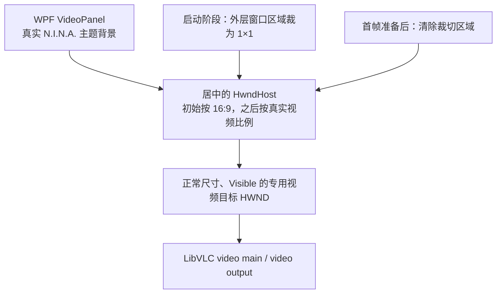
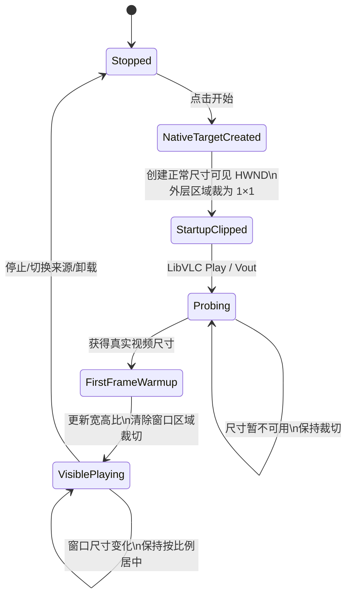

# RTSP 实时预览白底与空白事故：根因、设计取舍和最终修复

## 文档状态

- 状态：已修复，并完成真实 N.I.N.A.、真实 RTSP 摄像机和在线天气分析联合验收
- 确认日期：2026-08-23
- 修复版本：`1.22.4.0`
- 首个完整修复提交：`cadefb4`（`fix: stabilize native RTSP preview lifecycle`）
- 影响范围：AI Weather 的 N.I.N.A. 内嵌 RTSP 实时预览
- 不受本事故直接影响的链路：OpenCV 天气分析捕获、Safety Monitor 判断和教师—学生标签绑定

本文档记录一次涉及 WPF `HwndHost`、Win32 子窗口、LibVLC Direct3D 视频输出和 N.I.N.A. 主题背景的显示事故。它与 [RTSP 分析通道旧帧事故](RTSP_STALE_FRAME_INCIDENT.zh-CN.md) 是两件不同的事：旧帧事故会让天气分析拿到历史画面，属于安全与数据正确性问题；本事故主要表现为实时预览白底、白边或暂时无画面，分析通道仍可能正常工作。

## 1. 摘要

插件最初把 LibVLC 直接绑定到覆盖整个预览面板的原生 `HwndHost`。LibVLC 会在目标 HWND 内创建自己的 `VLC video main` 和 `VLC video output` 子窗口；这些窗口在视频比例不匹配、首帧尚未到达或 Direct3D 重新建立输出时，可能用系统默认白色清除原生区域。WPF 背景和普通 WPF 遮罩无法可靠覆盖这些原生 HWND，于是出现白色上下边、整块白色或随机恢复白色。

中间修复曾把视频目标隐藏、缩成 `1×1` 或放到不可见位置。这样虽然暂时避免白色，却使本机 LibVLC/摄像机组合无法正常建立视频输出，触发 `buffer deadlock prevented`，最终形成“天气分析成功但预览一直空白”的 `1.22.3` 回归。

最终方案同时满足两个看似矛盾的约束：

- LibVLC 必须始终获得一个正常尺寸、`Visible`、位于屏幕内的原生视频目标，才能可靠初始化；
- 在首帧准备好以前，这个原生空域又不能出现在用户屏幕上，否则会暴露系统白底。

实现方法是：保持视频目标本身为正常尺寸和可见状态，只把最外层 `HwndHost` 的**可见窗口区域**暂时裁成一个原生像素。LibVLC 仍对完整目标解码，用户看到的则是下面真正的 N.I.N.A. WPF 主题背景。确认视频尺寸并经过短暂首帧准备后，清除裁切区域，显示实时画面。视频出现后，整个原生宿主按照真实宽高比居中，因此周围留白也是 WPF 主题像素，而不是 VLC 的原生留白。

## 2. 用户可见症状

本次排查期间依次出现过四类症状：

1. RTSP 画面保持完整比例时，上下或左右留白为纯白，而 N.I.N.A. 使用深色主题。
2. 点击开始后，视频尚未出现时，中央未来的 `16:9` 区域先显示为整块白色。
3. 画面已经显示后，在 LibVLC 重绘或窗口尺寸变化时，留白偶发恢复成白色。
4. `1.22.3` 中天气分析已经执行、状态和文字说明也在更新，但实时预览完全不出现。

第 4 种现象尤其容易误导：插件的实时预览与天气分析是两条独立 RTSP 消费链路。预览由 LibVLC 播放；天气分析由 OpenCV 持续读取最新帧。分析成功不能证明 LibVLC 的 HWND 正在显示，反过来预览正常也不能证明分析帧一定新鲜。

## 3. 技术背景：WPF 原生空域

WPF 主要由一个合成表面渲染，而 `HwndHost` 嵌入的是独立 Win32 窗口。原生 HWND 会形成所谓的 airspace（原生空域）：

- WPF 背景画刷不会自动成为 HWND 的背景；
- WPF 元素通常不能覆盖原生子窗口；
- 原生兄弟窗口之间的 Z 顺序也可能被 Direct3D 视频输出绕过或重新调整；
- LibVLC 可以在传入的目标 HWND 下继续创建多层原生子窗口。

故障窗口树的典型结构如下：

```text
N.I.N.A. WPF 窗口
└─ HwndHost 外层 Static
   ├─ 插件创建的专用视频目标 Static
   │  └─ VLC video main ...
   │     └─ VLC video output ...
   └─ 插件创建的主题遮罩 Static
```

`VLC video output` 使用 Direct3D 呈现时，即使主题遮罩在 Win32 Z 顺序中看似更高，屏幕合成结果仍可能由视频表面覆盖。因而“再加一个深色矩形盖住它”不是稳定方案。

## 4. 根因分解

### 4.1 原始结构遗留：LibVLC 占据整个预览面板

最初的实现让 LibVLC 直接拥有整个预览面板大小的 HWND。源视频是 `16:9`，面板经常更高或更宽，LibVLC 因此在自己的原生表面内生成 letterbox/pillarbox。视频内容本身正常，但留白属于 VLC/Win32，而不是 N.I.N.A. 主题；任何原生重绘都可能把这些像素清成白色。

这部分问题来源于原始预览架构，而不是教师—学生数据集、Gemini 配额保护或 RTSP 最新帧修复。

### 4.2 中间方案回归：隐藏或缩小视频目标

为避免白色原生区域，中间方案尝试过：

- 创建隐藏的内层视频目标；
- 把目标保持为 `1×1`；
- 把目标移动到屏幕外；
- 先隐藏，取得尺寸后再显示。

真实设备验证表明，这些做法会改变 LibVLC 的初始化条件：其后代窗口可能继承隐藏状态，或者 Direct3D 得不到有效的可见输出表面。本机日志会出现：

```text
VLC: buffer deadlock prevented
```

结果是 OpenCV 分析仍可工作，但 LibVLC 预览不出画面。这是我们在修白底过程中引入的 `1.22.3` 回归，后来已撤销。

### 4.3 首帧前白块：普通 Static 目标窗口的默认绘制

即使视频目标尺寸和可见性都正确，点击开始后的最初阶段仍可能没有 `VLC video output` 子窗口。此时屏幕上显示的是交给 VLC 的普通 Win32 `Static` 控件；它的默认客户区可以是白色。随后 VLC 创建 Direct3D 输出窗口，这个窗口在首帧到达前也可能短暂显示白色。

因此白色并非只有一层：最初来自视频目标本身，稍后可能来自 VLC 输出子窗口。仅修改 WPF `Background`、外层 HWND 画刷或兄弟遮罩，都不能覆盖完整生命周期。

### 4.4 过早判定“首帧已准备”

`MediaPlayer.Play()` 返回 `true`、状态变为 `Playing`，甚至 `libvlc_video_get_size` 返回宽高，都不保证屏幕上已经呈现第一帧。最终实现把“有解码尺寸”和短暂首帧准备作为揭开原生窗口的最低条件，并在 60 秒内持续探测实际输出。

## 5. 现场证据

### 5.1 原生窗口树

白屏时读到的窗口树包括正常可见的：

```text
Static                       675x380
Static                       675x380
VLC video main ...           675x380
VLC video output ...         675x380
Static (theme cover)         675x380
```

这证明白色不是一张错误图片，也不是 WPF `Image.Stretch` 产生的填充，而是独立原生窗口表面。

### 5.2 屏幕像素复现

在未修复版本中，同一中央屏幕像素的自动采样结果为：

| 阶段 | RGB |
|---|---|
| 停止状态、只有 N.I.N.A. 背景 | `42, 44, 49` |
| 点击开始后 150 ms | `255, 255, 255` |
| 点击开始后 650 ms | `255, 255, 255` |
| 点击开始后 2650 ms | `255, 255, 255` |

把原生宿主裁切后，同一位置立即恢复为 N.I.N.A. 主题色 `42,44,49`；解除裁切后立即恢复实时视频像素。这是最终选择“裁切原生宿主、保留正常视频目标”的直接证据。

### 5.3 与分析链路的对照

白色或空白预览期间，日志仍可出现：

- OpenCV RTSP 连接建立；
- 本地天气分析完成；
- Gemini 分析完成；
- Safety Monitor 状态更新；
- 数据集样本写入。

这进一步证明显示故障位于 LibVLC/WPF 预览链路，而不是模型请求、标签记录或安全状态逻辑。

## 6. 最终设计

### 6.1 结构



### 6.2 启动状态机



### 6.3 为什么裁的是宿主可见区域，而不是视频目标尺寸

这两种 `1×1` 有本质区别：

| 做法 | LibVLC 看到的目标 | 屏幕上可见区域 | 结果 |
|---|---|---|---|
| 失败方案：视频目标缩成 `1×1` | `1×1` | `1×1` | Direct3D/解码可能死锁，不出画面 |
| 最终方案：宿主窗口区域裁成 `1×1` | 正常 `675×380`、Visible、在屏幕内 | 1 个原生像素 | 解码正常；其余区域露出 WPF 主题 |

最终方案调用 `SetWindowRgn` 只改变外层 HWND 的可见区域，不改变专用视频目标的大小、可见状态和屏幕位置。真实设备在保持裁切 60 秒的测试中仍成功完成 LibVLC 初始化；解除裁切时视频已经正常播放。

### 6.4 宽高比与留白归属

启动时按 `16:9` 创建居中宿主，避免全高面板被原生窗口占满。取得真实宽高后，使用 `VideoFitCalculator.FitInside` 重新计算：

```text
scale = min(panelWidth / videoWidth, panelHeight / videoHeight)
hostWidth  = videoWidth  × scale
hostHeight = videoHeight × scale
```

整个 HwndHost 本身就只有视频比例大小，因此四周所有 letterbox/pillarbox 都属于 `VideoPanel` 的 WPF 背景。LibVLC 不再拥有、也无法重绘这些留白像素。

### 6.5 视频尺寸探测

尺寸探测按以下顺序工作：

1. 调用 LibVLC `MediaPlayer.Size` 获取源视频宽高；
2. 如果 LibVLC API 暂未返回尺寸，枚举专用视频目标下的 `VLC video output` 子窗口，使用其客户区作为临时可测尺寸；
3. 最长探测 60 秒；
4. 探测期间保持启动裁切；
5. 如果超过 60 秒仍没有尺寸，保持主题背景，不主动暴露白色原生表面，并写入警告日志。

### 6.6 并发 Vout 防护

LibVLC 的 `Vout` 和 `Playing` 通知可能重复或交错到达，从而启动多个异步探测任务。任意一个任务成功显示视频后，其他迟到任务必须先检查 `_videoSurfaceReady`，不得再次施加启动裁切。否则已经播放的预览可能在数秒后突然消失，看起来像随机故障。

## 7. 被否决的方案

| 方案 | 否决原因 |
|---|---|
| 只修改 WPF `Background` | WPF 画刷无法控制 `HwndHost` 下的原生 Direct3D 表面 |
| 修改外层 Static 背景画刷 | VLC 子窗口位于其上方，仍可清成白色 |
| 添加主题色原生兄弟遮罩并置顶 | Direct3D 视频表面的合成不可靠地服从兄弟窗口视觉顺序；VLC 还会重排子窗口 |
| 让 VLC 直接占满面板、依赖自动比例 | 留白仍属于 VLC 原生表面，随机重绘会恢复白色 |
| 隐藏视频目标 | VLC 后代窗口继承隐藏状态，预览可能永远不可见 |
| 将视频目标设为 `1×1` | 真实设备触发视频输出死锁 |
| 将视频目标移动到屏幕外 | 本机组合无法稳定建立有效 vout |
| `Play()` 成功后立即显示 | `Playing` 不等于首帧已经呈现 |

## 8. 生命周期和资源安全

停止流、切换来源或卸载视图时，按以下顺序处理：

1. 取消当前启动探测令牌；
2. 解除 MediaPlayer 事件订阅；
3. 停止并释放 LibVLC `MediaPlayer` 和 `Media`；
4. 从 WPF 容器移除 `VideoHwndHost`；
5. 销毁外层 HWND；其专用视频目标、VLC 后代窗口和主题表面随父窗口销毁；
6. 释放插件创建的 GDI 画刷。

`SetWindowRgn` 成功后，区域句柄所有权转交 Windows；失败时由插件调用 `DeleteObject` 释放，避免 GDI 泄漏。

## 9. 验收结果

最终 `1.22.4.0` 在真实 N.I.N.A. 和真实全天相机上的自动验收结果：

| 时间点 | 结果 |
|---|---|
| 点击开始后 150 ms | 整个预览区为 N.I.N.A. 主题背景；中央 RGB=`42,44,49`，无白块 |
| 点击开始后 650 ms | 已显示真实天空实时画面 |
| 2.65 秒 | 画面继续正常更新，无白边 |
| 5.65 秒 | 画面继续正常更新，无白边 |
| 分析完成 | 本地分析、Gemini 分析、安全状态和数据集写入均正常 |
| 人工复测 | 多次停止、重新开始和重启 N.I.N.A.，用户确认通过 |

编译与自动测试：

- 主项目：0 个错误；保留项目既有兼容性/可空性警告；
- `git diff --check`：通过；
- 数据集、Gemini 配额退避、本地回退和本地化冒烟测试：`PASS dataset smoke suite`；
- 构建 DLL 与安装到 N.I.N.A. 的 DLL SHA-256 完全一致。

## 10. 运维判据

### 正常

- 点击开始后先看到 N.I.N.A. 主题背景，随后直接出现画面；
- 日志出现 `RTSP preview nested fit`；
- 随后出现 `Stream startup complete`；
- 画面与天气分析都在更新。

### 需要继续排查

- 60 秒后仍没有 `Stream startup complete`；
- 持续出现 `buffer deadlock prevented` 且没有画面；
- `MediaPlayer` 已停止或报错；
- 视频正常但分析帧时间戳落后——这属于另一份旧帧事故文档的范围；
- 分析正常但预览为空——优先检查 LibVLC 窗口树和 `Vout` 生命周期。

单独出现一次 `buffer deadlock prevented` 不能直接判定故障；如果随后尺寸探测、实时画面和分析均正常，它只是 LibVLC 在输出切换阶段的一条恢复性日志。判断必须以最终画面、播放器状态和启动完成日志为准。

## 11. 安全与隐私边界

预览布局代码不得把带用户名、密码或令牌的完整 RTSP URL 写入新增诊断日志。本文档也不记录摄像机口令、API 密钥或完整认证地址。此修复只改变显示窗口布局和生命周期，不改变教师标签来源、安全阈值、天气判断或数据集脱敏规则。

## 12. 后续维护原则

未来修改 RTSP 预览时必须保持以下不变量：

1. 交给 LibVLC 的视频目标必须是正常尺寸、可见且位于屏幕内；
2. 首帧准备前不得直接暴露原生视频空域；
3. 留白应由 WPF 面板承担，不应留给 VLC；
4. 重复 `Vout` 任务不能重新隐藏已经播放的表面；
5. 预览与天气分析是独立链路，验收必须分别检查；
6. 至少执行一次真实摄像机的停止、启动、窗口缩放和 N.I.N.A. 重启测试，不能只依赖静态布局单元测试。
