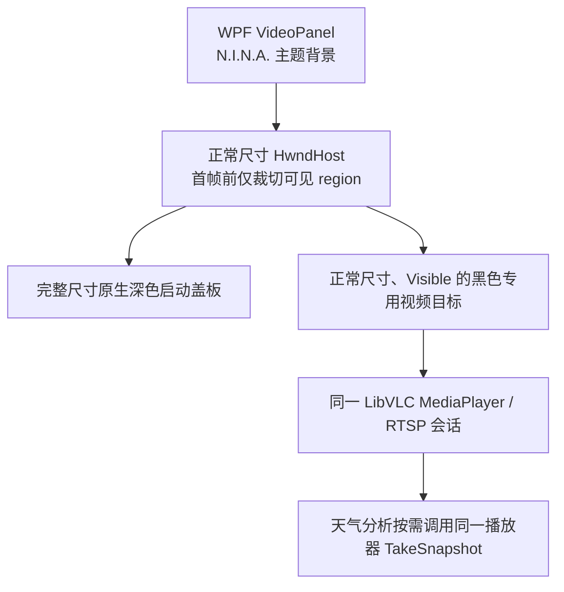
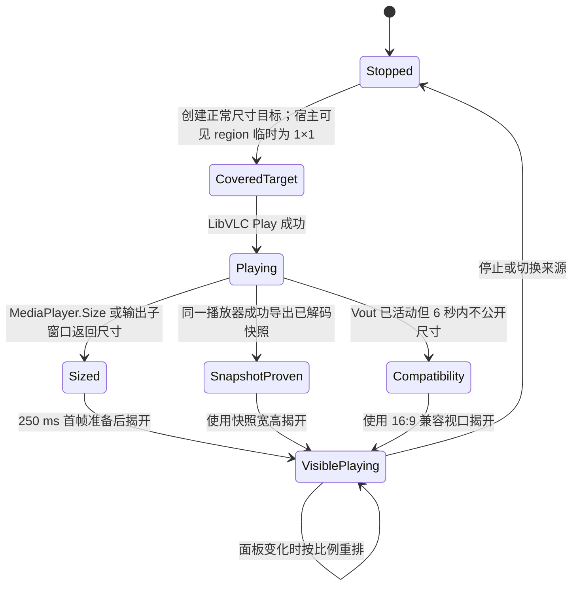

# RTSP 实时预览白底与空白事故：根因、跨机器回归与修复

## 文档状态

- 状态：第一阶段白底修复已验收；`1.30.0.0` 的跨机器归因经现场日志证伪；`1.30.1.0` 已按传输层证据修正
- 确认日期：2026-08-23
- 空域与启动显示修复版本：`1.22.4.0`
- 长时播放冻结修复版本：`1.22.5.0`
- 跨机器传输失败显示与退避热修：`1.30.1.0`
- 首个完整修复提交：`cadefb4`（`fix: stabilize native RTSP preview lifecycle`）
- 影响范围：AI Weather 的 N.I.N.A. 内嵌 RTSP 实时预览
- 不受本事故直接影响的链路：OpenCV 天气分析捕获、Safety Monitor 判断和教师—学生标签绑定

本文档记录一次涉及 WPF `HwndHost`、Win32 子窗口、LibVLC Direct3D 视频输出和 N.I.N.A. 主题背景的显示事故。它与 [RTSP 分析通道旧帧事故](RTSP_STALE_FRAME_INCIDENT.zh-CN.md) 是两件不同的事：旧帧事故会让天气分析拿到历史画面，属于安全与数据正确性问题；本事故主要表现为实时预览白底、白边或暂时无画面，分析通道仍可能正常工作。

## 1. 摘要

插件最初把 LibVLC 直接绑定到覆盖整个预览面板的原生 `HwndHost`。LibVLC 会在目标 HWND 内创建自己的 `VLC video main` 和 `VLC video output` 子窗口；这些窗口在视频比例不匹配、首帧尚未到达或 Direct3D 重新建立输出时，可能用系统默认白色清除原生区域。WPF 背景和普通 WPF 遮罩无法可靠覆盖这些原生 HWND，于是出现白色上下边、整块白色或随机恢复白色。

中间修复曾把视频目标隐藏、缩成 `1×1` 或放到不可见位置。这样虽然暂时避免白色，却使本机 LibVLC/摄像机组合无法正常建立视频输出，触发 `buffer deadlock prevented`，最终形成“天气分析成功但预览一直空白”的 `1.22.3` 回归。

第一阶段方案曾试图同时满足两个看似矛盾的约束：

- LibVLC 必须始终获得一个正常尺寸、`Visible`、位于屏幕内的原生视频目标，才能可靠初始化；
- 在首帧准备好以前，这个原生空域又不能出现在用户屏幕上，否则会暴露系统白底。

最初实现保持视频目标本身为正常尺寸和可见状态，但把最外层 `HwndHost` 的**可见窗口区域**暂时裁成一个原生像素。它在首台电脑上通过了真实设备验收。另一台从节点随后出现永久空白，我们一度在没有传输层日志的情况下错误推断为该 region 与另一种 Windows/显卡后端不兼容，并在 `1.30.0.0` 中取消 region。

完整现场日志后来证伪了这个判断：从节点在产生任何 `Vout` 或解码尺寸以前就明确报告 `Failed to connect to RTSP server`，目标为同步得到的另一个私有网段中的摄像机端口。现场既没有证明存在从该节点到摄像机网段的可用路由，也没有完成 TCP/RTSP 会话。取消 region 不可能修复网络不可达，只会把连接阶段的 LibVLC 白色原生表面暴露出来，形成截图中的巨大白块。因此 `1.30.1.0` 恢复启动 region，并把传输失败、显示失败和分析失败明确分层。

## 2. 用户可见症状

本次排查期间依次出现过四类症状：

1. RTSP 画面保持完整比例时，上下或左右留白为纯白，而 N.I.N.A. 使用深色主题。
2. 点击开始后，视频尚未出现时，中央未来的 `16:9` 区域先显示为整块白色。
3. 画面已经显示后，在 LibVLC 重绘或窗口尺寸变化时，留白偶发恢复成白色。
4. `1.22.3` 中天气分析已经执行、状态和文字说明也在更新，但实时预览完全不出现。

第 4 种现象尤其容易误导：插件的实时预览与天气分析是两条独立 RTSP 消费链路。预览由 LibVLC 播放；天气分析由 OpenCV 持续读取最新帧。分析成功不能证明 LibVLC 的 HWND 正在显示，反过来预览正常也不能证明分析帧一定新鲜。

## 3. 技术背景：WPF 原生空域

WPF 主要由一个合成表面渲染，而 `HwndHost` 嵌入的是独立 Win32 窗口。原生 HWND 会形成所谓的 airspace（原生空域）：

- WPF 背景画刷不会自动成为 HWND 的背景；
- WPF 元素通常不能覆盖原生子窗口；
- 原生兄弟窗口之间的 Z 顺序也可能被 Direct3D 视频输出绕过或重新调整；
- LibVLC 可以在传入的目标 HWND 下继续创建多层原生子窗口。

故障窗口树的典型结构如下：

```text
N.I.N.A. WPF 窗口
└─ HwndHost 外层 Static
   ├─ 插件创建的专用视频目标 Static
   │  └─ VLC video main ...
   │     └─ VLC video output ...
   └─ 插件创建的主题遮罩 Static
```

`VLC video output` 使用 Direct3D 呈现时，即使主题遮罩在 Win32 Z 顺序中看似更高，屏幕合成结果仍可能由视频表面覆盖。因而“再加一个深色矩形盖住它”不是稳定方案。

## 4. 根因分解

### 4.1 原始结构遗留：LibVLC 占据整个预览面板

最初的实现让 LibVLC 直接拥有整个预览面板大小的 HWND。源视频是 `16:9`，面板经常更高或更宽，LibVLC 因此在自己的原生表面内生成 letterbox/pillarbox。视频内容本身正常，但留白属于 VLC/Win32，而不是 N.I.N.A. 主题；任何原生重绘都可能把这些像素清成白色。

这部分问题来源于原始预览架构，而不是教师—学生数据集、Gemini 配额保护或 RTSP 最新帧修复。

### 4.2 中间方案回归：隐藏或缩小视频目标

为避免白色原生区域，中间方案尝试过：

- 创建隐藏的内层视频目标；
- 把目标保持为 `1×1`；
- 把目标移动到屏幕外；
- 先隐藏，取得尺寸后再显示。

真实设备验证表明，这些做法会改变 LibVLC 的初始化条件：其后代窗口可能继承隐藏状态，或者 Direct3D 得不到有效的可见输出表面。本机日志会出现：

```text
VLC: buffer deadlock prevented
```

结果是 OpenCV 分析仍可工作，但 LibVLC 预览不出画面。这是我们在修白底过程中引入的 `1.22.3` 回归，后来已撤销。

### 4.3 首帧前白块：普通 Static 目标窗口的默认绘制

即使视频目标尺寸和可见性都正确，点击开始后的最初阶段仍可能没有 `VLC video output` 子窗口。此时屏幕上显示的是交给 VLC 的普通 Win32 `Static` 控件；它的默认客户区可以是白色。随后 VLC 创建 Direct3D 输出窗口，这个窗口在首帧到达前也可能短暂显示白色。

因此白色并非只有一层：最初来自视频目标本身，稍后可能来自 VLC 输出子窗口。仅修改 WPF `Background`、外层 HWND 画刷或兄弟遮罩，都不能覆盖完整生命周期。

### 4.4 过早判定“首帧已准备”

`MediaPlayer.Play()` 返回 `true`、状态变为 `Playing`，甚至 `libvlc_video_get_size` 返回宽高，都不保证屏幕上已经呈现第一帧；反过来，一些 Windows 视频后端已经解码并能够导出快照，却始终让 `video_get_size` 保持为 `0×0`。因此不能把单一 API 当成永久遮挡或揭开的唯一条件。当前实现采用尺寸、原生输出子窗口、已解码快照三重证据，并为已经触发 `Vout` 的后端设置 6 秒有界兼容揭开。

## 5. 现场证据

### 5.1 原生窗口树

白屏时读到的窗口树包括正常可见的：

```text
Static                       675x380
Static                       675x380
VLC video main ...           675x380
VLC video output ...         675x380
Static (theme cover)         675x380
```

这证明白色不是一张错误图片，也不是 WPF `Image.Stretch` 产生的填充，而是独立原生窗口表面。

### 5.2 屏幕像素复现

在未修复版本中，同一中央屏幕像素的自动采样结果为：

| 阶段 | RGB |
|---|---|
| 停止状态、只有 N.I.N.A. 背景 | `42, 44, 49` |
| 点击开始后 150 ms | `255, 255, 255` |
| 点击开始后 650 ms | `255, 255, 255` |
| 点击开始后 2650 ms | `255, 255, 255` |

把原生宿主裁切后，同一位置立即恢复为 N.I.N.A. 主题色 `42,44,49`；解除裁切后立即恢复实时视频像素。这是最终选择“裁切原生宿主、保留正常视频目标”的直接证据。

### 5.3 与分析链路的对照

白色或空白预览期间，日志仍可出现：

- OpenCV RTSP 连接建立；
- 本地天气分析完成；
- Gemini 分析完成；
- Safety Monitor 状态更新；
- 数据集样本写入。

这进一步证明显示故障位于 LibVLC/WPF 预览链路，而不是模型请求、标签记录或安全状态逻辑。

### 5.4 另一套台站的传输层反证（2026-08-29）

从节点与主节点位于同一个私有网段，同步得到的摄像机却位于另一个私有网段。集群配置同步成功，但每一次本地预览均遵循同样的失败序列（以下地址已脱敏）：

```text
Play() returned: True, Player state: NothingSpecial
VLC: Failed to connect with rtsp://<camera-private-ip>:554/...
VLC: Failed to connect to RTSP server <camera-private-ip>:554
Final state: Opening, IsPlaying: False
```

`Play() == true` 只表示 LibVLC 接受了异步播放请求，不表示 TCP、RTSP、鉴权或解码已经成功。日志中没有 `Vout`，也没有任何视频尺寸；在约 90 秒内同一失败被状态通知触发了 21 次。主节点失联后本地接管已经启动，但仍然连接同一个不可达地址，所以接管不能改变结果。

这个证据将故障边界确定为：集群同步成功，UI 创建成功，LibVLC 播放请求成功入队，但从节点到摄像机的 TCP/RTSP 路径失败。若主节点有第二块网卡或静态路由而从节点没有，那么只有主节点能看到相机是符合网络拓扑的；真正的接管要求两个节点都能**不依赖对方**访问摄像机网段。

## 6. 当前设计（证据修正版）

### 6.1 单终端单会话结构



主节点和从节点可以各自建立一条到同一摄像头的 RTSP 会话；但在任意一台电脑内部，预览与天气分析只共享这一条 LibVLC 会话，不额外打开 OpenCV/FFmpeg 会话。只有共享播放器无法给出新帧时，独立解码器才作为健康回退尝试。

### 6.2 启动状态机



### 6.3 启动裁切的边界与证据要求

`SetWindowRgn(parent, 1×1)` 不改变 `GetClientRect`，视频目标仍保持正常尺寸、可见、位于屏幕内；它只在首帧前阻止原生白色空域覆盖 WPF 主题背景。首台真实设备已经证明 LibVLC 可以在此条件下建立 vout。`1.30.0.0` 曾因为另一台从节点的空白而取消裁切，但完整日志随后证明那台机器根本没有建立到摄像机的 TCP/RTSP 连接，不能把“没有 vout”归咎于显示 region。

因此当前实现恢复启动裁切，在取得尺寸、原生输出窗口或已解码快照等首帧证据后立刻解除。若未来另有机器能证明“TCP/RTSP 已连接并持续收到/解码视频，但仅使用 region 时不产生 vout”，才有理由重新评估该机制；网络连接失败不能作为显示后端不兼容的证据。

### 6.4 宽高比与留白归属

启动时按 `16:9` 创建居中宿主；取得 LibVLC、原生输出窗口或快照给出的真实宽高后，使用 `VideoFitCalculator.FitInside` 重新计算：

```text
scale = min(panelWidth / videoWidth, panelHeight / videoHeight)
hostWidth  = videoWidth  × scale
hostHeight = videoHeight × scale
```

整个 HwndHost 只占视频比例的区域，四周 letterbox/pillarbox 仍属于 `VideoPanel` 的 WPF 主题背景。若后端拒绝公开尺寸，暂以 `16:9` 兼容比例运行；这比永久空白更安全，也符合当前全天相机的真实输出比例。

### 6.5 三重就绪判据

按以下优先级证明画面已解码：

1. `MediaPlayer.Size` 返回有效宽高；
2. 枚举专用目标下的 `VLC video output` 子窗口得到有效客户区；
3. 同一 `MediaPlayer.TakeSnapshot` 成功产生可解码图片，并使用图片宽高。

如果上述接口在 6 秒内都不给结果，但已经收到 `Vout`，插件使用 `16:9` 兼容视口揭开活动输出。快照探测只使用现有播放器，不会增加 RTSP 连接。

### 6.6 可观察性与人工恢复

视频面板现在区分“天气安全状态”和“本机视频状态”。连接期间显示“正在连接本机相机视频流”；LibVLC、URL、HWND、播放或画面揭开失败时会显示明确原因和“重试本机视频”按钮。重试会强制重建本机播放器，但不会重连主节点、不会改变 Safety Monitor 判定，也不会保存或打印同步凭据。

### 6.7 并发 Vout 防护

LibVLC 的 `Vout` 和 `Playing` 通知可能重复或交错到达。任意任务成功显示视频后，其他迟到任务先检查 `_videoSurfaceReady`，不得重新抬起盖板。用户手动重试则显式 `forceRestart`，避免 `IsPlaying=true` 但画面尚未揭开时被错误当成健康播放。

## 7. 被否决的方案

| 方案 | 否决原因 |
|---|---|
| 只修改 WPF `Background` | WPF 画刷无法控制 `HwndHost` 下的原生 Direct3D 表面 |
| 修改外层 Static 背景画刷 | VLC 子窗口位于其上方，仍可清成白色 |
| 只添加 WPF 遮罩 | WPF 无法覆盖 HwndHost 原生空域；当前使用的是同一原生宿主内的 Win32 盖板和黑色目标 |
| 让 VLC 直接占满面板、依赖自动比例 | 留白仍属于 VLC 原生表面，随机重绘会恢复白色 |
| 隐藏视频目标 | VLC 后代窗口继承隐藏状态，预览可能永远不可见 |
| 将视频目标设为 `1×1` | 真实设备触发视频输出死锁 |
| 将视频目标移动到屏幕外 | 本机组合无法稳定建立有效 vout |
| 在没有传输层证据时取消父 HwndHost 的启动 region | 无法修复 TCP/RTSP 不可达，反而会在连接等待和失败期间暴露 LibVLC 的白色原生表面；这是 `1.30.0.0` 的回归 |
| `Play()` 成功后立即显示 | `Playing` 不等于首帧已经呈现 |

## 8. 生命周期和资源安全

停止流、切换来源或卸载视图时，按以下顺序处理：

1. 取消当前启动探测令牌；
2. 解除 MediaPlayer 事件订阅；
3. 停止并释放 LibVLC `MediaPlayer` 和 `Media`；
4. 从 WPF 容器移除 `VideoHwndHost`；
5. 销毁外层 HWND；其专用视频目标、VLC 后代窗口和主题表面随父窗口销毁；
6. 释放插件创建的 GDI 画刷。

当前版本只在首帧前创建并转交一个 `1×1` 启动 region。成功的 `SetWindowRgn` 调用会把 region 所有权交给系统；调用失败时由插件释放。停止时仍释放插件创建的 GDI 画刷、原生窗口、MediaPlayer、Media 和共享帧注册。

## 9. 验收结果

以下是第一阶段 `1.22.4.0` 在首台真实 N.I.N.A. 和真实全天相机上的历史验收结果。它证明启动 region 在该环境中既消除了白底，也没有妨碍建立视频输出：

| 时间点 | 结果 |
|---|---|
| 点击开始后 150 ms | 整个预览区为 N.I.N.A. 主题背景；中央 RGB=`42,44,49`，无白块 |
| 点击开始后 650 ms | 已显示真实天空实时画面 |
| 2.65 秒 | 画面继续正常更新，无白边 |
| 5.65 秒 | 画面继续正常更新，无白边 |
| 分析完成 | 本地分析、Gemini 分析、安全状态和数据集写入均正常 |
| 人工复测 | 多次停止、重新开始和重启 N.I.N.A.，用户确认通过 |

编译与自动测试：

- 主项目：0 个错误；保留项目既有兼容性/可空性警告；
- `git diff --check`：通过；
- 数据集、Gemini 配额退避、本地回退和本地化冒烟测试：`PASS dataset smoke suite`；
- 构建 DLL 与安装到 N.I.N.A. 的 DLL SHA-256 完全一致。

2026-08-29 `1.30.1.0` 证据修正后的自动结果：

- 主项目 Release 编译：0 个错误；
- 数据集、主从协议、单会话共享帧、Gemini 临时模型回退及本地化冒烟套件：通过；
- `git diff --check`：通过；
- 从节点现场日志：集群同步与本地接管均成功，但到另一个私有网段的摄像机 RTSP 连接失败；在修复该节点的网络路径前，不存在可供显示层验收的视频帧。
- 同一失败源的自动重试有 60 秒退避；新地址、退避到期或人工重试可立即尝试，避免状态刷新造成 5 秒一次的重连风暴。
- 自动测试不能模拟另一台电脑的路由和真实相机，因此网络可达性与最终画面仍必须在该节点现场验证。

## 10. 运维判据

### 正常

- 点击开始后先看到 N.I.N.A. 主题背景，随后直接出现画面；
- 日志出现 `RTSP preview nested fit`；
- 随后出现 `Stream startup complete`；
- 画面与天气分析都在更新。

### 需要继续排查

- 日志出现 `Failed to connect to RTSP server`：先检查从当前节点到摄像机 IP/端口的网络路径，不要归因于 WPF 或显卡；
- 60 秒后仍没有成功的 `Stream startup complete`；
- 持续出现 `buffer deadlock prevented` 且没有画面；
- `MediaPlayer` 已停止或报错；
- 视频正常但分析帧时间戳落后——这属于另一份旧帧事故文档的范围；
- 分析正常但预览为空——优先检查 LibVLC 窗口树和 `Vout` 生命周期。

单独出现一次 `buffer deadlock prevented` 不能直接判定故障；如果随后尺寸探测、实时画面和分析均正常，它只是 LibVLC 在输出切换阶段的一条恢复性日志。判断必须以最终画面、播放器状态和启动完成日志为准。

## 11. 安全与隐私边界

预览布局代码不得把带用户名、密码或令牌的完整 RTSP URL 写入新增诊断日志。本文档也不记录摄像机口令、API 密钥或完整认证地址。此修复只改变显示窗口布局和生命周期，不改变教师标签来源、安全阈值、天气判断或数据集脱敏规则。

## 12. 后续维护原则

未来修改 RTSP 预览时必须保持以下不变量：

1. 交给 LibVLC 的视频目标必须是正常尺寸、可见且位于屏幕内；
2. 首帧准备前不得直接暴露原生视频空域；
3. 留白应由 WPF 面板承担，不应留给 VLC；
4. 重复 `Vout` 任务不能重新隐藏已经播放的表面；
5. 预览与天气分析是独立链路，验收必须分别检查；
6. 至少执行一次真实摄像机的停止、启动、窗口缩放和 N.I.N.A. 重启测试，不能只依赖静态布局单元测试。

## 13. 后续事故：长时播放后停在最后一帧

### 13.1 症状与边界

`1.22.4.0` 通过白底和启动生命周期验收后，预览连续运行约四小时开始变慢，随后停在最后一帧。同期：

- OBS 的非 VLC 媒体源继续正常显示同一摄像机；
- 插件的 OpenCV 捕获和本地/Gemini 识别继续产生新结果；
- N.I.N.A. 主界面仍响应；
- N.I.N.A. 进程五秒采样只使用约 `16.8%` 的单核，即整机 16 逻辑处理器的约 `1%`，并非解码算力耗尽。

这证明故障不在 RTSP 服务端、网络、WPF 原生空域或分析链路，而在 LibVLC 的长时输入时钟与视频输出队列。

### 13.2 日志证据

一次连续运行中，日志最早在 `19:06:03` 出现：

```text
picture is too late to be displayed
```

从 `19:30:16` 起进入持续丢帧状态，到 `22:56` 仍未自行恢复。累计包括：

| LibVLC 诊断 | 数量 |
|---|---:|
| `More than 11 late frames, dropping frame` | 5,065 |
| `more than 5 seconds of late video -> dropping frame` | 16,332 |
| `picture is too late to be displayed` | 7,275 |

最后记录的显示延迟已经超过 6 秒。LibVLC 仍报告播放器处于 `Playing`，所以原有的 `IsPlaying` 检查会把冻结播放器误判为健康，并在视图重新加载时跳过重建。

用户补充的交叉证据是：同一摄像机在 OBS 的 VLC 来源中也曾出现相同问题，改用 OBS 原生媒体源后恢复。因而这不是插件新窗口布局特有的问题，而是该摄像机码流时间戳与 VLC 长时同步策略的兼容性问题。

### 13.3 `1.22.5.0` 的两层修复

第一层是针对无音频实时监控预览关闭 LibVLC 输入时钟纠正：

```text
:clock-synchro=0
:clock-jitter=0
:drop-late-frames
:skip-frames
```

VLC 3.0.21 自带的选项说明明确指出：实时来源出现网络流播放卡顿时可以关闭输入时钟同步；`clock-jitter` 是同步算法尝试补偿的最大输入延迟抖动。本插件预览没有音频，不需要维持音视频同步，因此画面新鲜度优先于跟随相机长期漂移的时间戳。

第二层是独立的预览健康看门狗：

1. 聚合 `late frames`、`late video`、`picture is too late` 和 `buffer too late`；
2. 只有同一连续突发至少维持 15 秒且累计达到 30 条时才判定冻结，避免一次网络抖动触发重启；
3. 判定后只重建 LibVLC `MediaPlayer`、原生 HWND 和预览媒体，不停止 OpenCV 捕获、不清空最新天气结论、不重启 Safety Monitor；
4. 两次自动恢复至少间隔一分钟，避免坏码流导致紧密重启循环；
5. 视图不可见时只标记为不健康，等用户重新打开页面再重建；
6. `IsPlaying` 只有在看门狗未标记异常时才允许作为“无需重启”的依据。

### 13.4 日志限流

旧实现把 LibVLC 每一条迟帧消息原样写入 N.I.N.A. 日志，单次事故产生约 2.8 万条重复警告。`1.22.5.0` 改为每 30 秒输出一次带持续时间和累计数量的摘要；真正达到恢复条件时另写一条明确的“preview-only restart”记录。这样既保留证据，也避免日志 I/O 加剧系统压力。

### 13.5 新增维护不变量

1. 不得用 `MediaPlayer.IsPlaying` 单独证明实时预览仍在更新；
2. 预览恢复不得触碰独立的天气识别、安全状态和教师—学生数据集链路；
3. 对无音频全天相机，默认以最新帧为目标，不为无意义的音视频同步长期积累延迟；
4. 自动恢复必须有持续时间、消息数量和冷却时间三重门槛；
5. 高频原生日志必须汇总，不能逐帧写入 N.I.N.A. 日志。
