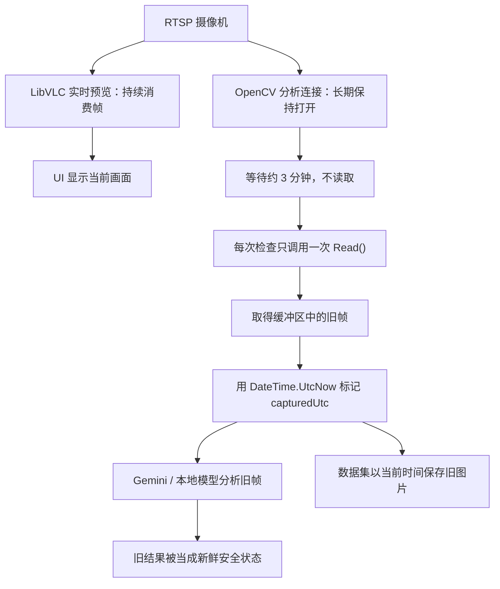

# RTSP 分析通道旧帧事故：原因、影响与修复方案

状态：已修复并完成自动化与实机验证

确认日期：2026-08-23

影响范围：使用 `RTSPStream` 捕获模式的 AI 天气分析、安全判定和教师—学生数据集

## 1. 摘要

插件的实时预览与天气分析使用两条独立的 RTSP 通道。实时预览由 LibVLC 持续播放，因此画面是当前的；天气分析则长期保持一个 OpenCV `VideoCapture`，但只在每次定时检查时调用一次 `Read()`。检查间隔通常为数分钟，期间没有持续消费 RTSP 视频，导致解码/网络缓冲区积压。

每次检查虽然成功返回一张合法图片，但得到的是连接建立时附近的旧帧。插件随后把本机当前时间写成 `capturedUtc`，使标签时间、太阳高度等上下文与真实图片时间错位。由于旧帧仍可被成功分析，数据新鲜度保护也会被错误刷新，可能长期依据旧天空报告安全状态。

这不是数据集异步队列把标签绑定到另一张图片。Gemini、本地学生模型和数据集记录器接收的是同一个 `Bitmap`；错误发生在更早的 RTSP 捕获层——该 `Bitmap` 本身已经陈旧。

## 2. 现场证据

2026-08-23 01:27:32 建立分析 RTSP 连接，01:27:37 报告连接成功。之后保存文件的系统时间继续前进，但图片左上角的摄像机叠字时间几乎停止：

| 标签或调试文件时间（本地） | 图片叠字时间（本地） | 约滞后 |
|---|---|---:|
| 01:27:39 | 01:27:32 | 7 秒 |
| 01:30:32 | 01:27:32 | 3 分钟 |
| 01:33:32 | 01:27:33 | 6 分钟 |
| 02:03:32 | 01:27:37 | 36 分钟 |
| 02:06:32 | 01:27:37 | 39 分钟 |
| 02:10:32 | 01:27:37 | 43 分钟 |

上一轮会话也呈现同样规律：分析连接于 00:58:55 建立，01:25:55 写出的图片叠字仍为 00:58:59，滞后约 27 分钟。每次重连后的首帧基本新鲜，随后滞后持续增长。

日志同时证明这不是错误回退路径：现场 `LibVLC snapshot fallback`、空帧和自动重建次数均为 0。OpenCV 一直返回成功，所以现有健康检查无法发现旧帧。

## 3. 失败链路

根本原因是“稀疏读取一个持续 RTSP 流”。`VideoCapture.IsOpened` 和 `Read()` 成功只证明连接与解码仍可工作，不能证明返回的是最新帧。

## 4. 代码来源判定

问题核心——长期保存 `_capture`，并在每次天气检查时仅执行一次 `_capture.Read(frame)`——已经存在于上游提交 `ab2763c`（上游 1.15.0.0），当前上游 `main` 的 `98b4187` 仍保留同样实现。

advanced 分支在 `b13ea37` 中对该区域的修改仅包括：

- 增加 disposed/initialized 防护；
- 统一日志凭据脱敏；
- 空帧连续失败后重建连接；
- 把同一分析帧克隆后写入教师—学生数据集。

这些修改没有引入“每隔数分钟只读一帧”的模式；空帧恢复也无法发现本事故，因为旧帧始终是非空且可解码的。因此根因来自上游，advanced 新增的数据集与标签检查器只是让时间错位变得可观察。

## 5. 影响

### 5.1 远程安全判定

这是最高风险。旧帧仍会让分析成功，插件会刷新 `_lastAnalysisUtc`，所以“最大数据年龄”保护不会触发。真实天气恶化时，Safety Monitor 可能继续依据几十分钟前的晴空结果报告安全。

### 5.2 在线 API 与本地分析

Gemini 和本地学生模型都在分析旧帧。近似相同的旧帧重复发送给生成式模型时，可能产生 `Overcast → Foggy → Overcast` 等非确定性变化，造成虚假的天气变化事件。

### 5.3 教师—学生数据集

- 图片与教师输出通常仍对应，因为两者使用同一个旧帧；
- `capturedUtc`、太阳高度、月相和安全上下文与真实图像时间错配；
- 同一小段旧视频可能被赋予互相矛盾的教师标签；
- 重复旧帧会扭曲类别分布和时序评估。

修复前采集的 RTSP 样本不应直接用于时序、安全策略或天文上下文训练。建议保留原始证据，但统一标记/移动到隔离区，待根据摄像机叠字和连接会话进一步审计。

## 6. 修复设计

### 6.1 持续排空，只保留最新帧

`RtspCaptureService` 在连接成功后启动独立后台读取循环：

1. 持续调用 OpenCV `Read()`，而不是等待天气检查才读取；
2. 每次成功解码后，用新的独立 `Bitmap` 原子替换内存中的“最新帧”；
3. 同时记录该帧的本机解码时间和单调递增序号；
4. 天气检查只克隆最新帧，不直接操作 `VideoCapture`；
5. 旧帧被替换时及时释放，避免内存泄漏。

这样即使天气检查间隔为几分钟，RTSP 缓冲区也一直被消费，检查取得的是最近解码帧。

### 6.2 新鲜度与启动保护

- 初始化必须等待后台读取器取得第一张非空帧后才算成功；
- `CaptureFrameAsync` 等待一张序号晚于调用开始时的帧，避免刚好重复交付上一轮帧；
- 设置严格的最大帧年龄（默认 10 秒）；超过上限返回失败，不得刷新天气分析时间；
- 连续读取异常或读循环退出时清空最新帧，使上层进入现有重连/Fail-Unsafe 流程；
- `Reset`/`Dispose` 必须取消并等待读取循环，再释放 OpenCV 资源。

### 6.3 可观测性

为每次成功捕获记录低频诊断信息：

- 帧序号；
- 解码时间；
- 交付时帧年龄；
- 捕获会话 ID；
- 是否发生重连或陈旧帧拒绝。

数据集后续应记录 `frameReceivedUtc` 与 `frameAgeMs`，不要只保存业务检查时间。

### 6.4 补充冻结保护

仅有“本机刚解码”仍不能排除摄像机自身冻结。后续可以结合连续内容哈希、视频时间戳或摄像机叠字 OCR，在多轮无变化时 Fail-Unsafe。此次修复首先消除已经证实的本地缓冲积压。

## 7. 验证标准

修复不能只以“编译成功”验收，必须满足：

1. 单元/烟雾测试模拟持续视频生产、低频天气检查，检查必须获得最新序号而非队列中的下一帧；
2. 重置和取消不会死锁或泄漏后台读取任务；
3. 超过最大年龄的帧必须被拒绝；
4. 实机连续运行至少两个检查周期；
5. 调试 JPEG 左上角摄像机时间与文件/标签本地时间保持在合理网络与分析延迟内，而不是随运行时间增长；
6. N.I.N.A. 日志无插件加载错误，Safety Monitor 在无新帧时不得刷新数据时间。

## 8. 修复实现与实机验收

修复已在 `1.22.0.0` 实现：

- 后台长驻读取线程持续消费 OpenCV/FFmpeg RTSP 流；
- 内存中只保存带接收时间和单调序号的最新帧；
- 每次分析必须等待序号更新，不能再次交付上一帧；
- 本机接收年龄超过 10 秒或 5 秒内没有新帧时，捕获失败并进入既有重连/Fail-Unsafe 路径；
- 原生 `VideoCapture` 由读取线程在 `Read()` 退出后自行释放，避免停止/重连线程并发释放造成 N.I.N.A. 进程级崩溃。

2026-08-23 02:26 的实机 RTSP 验收结果：

| 文件写入时间 | 画面左上角摄像机时间 | 固有延迟 |
| --- | --- | ---: |
| 02:26:26 | 02:26:19 | 约 7 秒 |
| 02:26:39 | 02:26:32 | 约 7 秒 |

两次采样相隔 13 秒，画面时间也完整前进 13 秒。相机/网络链路仍有约 7 秒固定延迟，但它不再随插件运行时间继续增长；这与修复前运行 39 分钟、画面只前进约 5 秒的表现有本质区别。自动回归还验证了最新序号替换、禁止重复交付、10 秒过期拒绝及缓冲清空语义。

修复前采集的数据仍保留作事故证据，但在审计前不应直接进入训练集。修复后仍建议观察至少数个正常天气检查周期；如果画面内容长期完全不变，即使接收序号仍增长，也应按第 6.4 节继续增加摄像机自身冻结检测。
