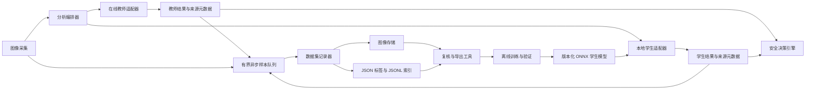

# AI Weather 教师—学生数据集与本地模型蒸馏技术设计

## 文档状态

| 项目 | 内容 |
|---|---|
| 状态 | 阶段 0 / 阶段 1 最小闭环与阶段 2 人工复核基线已实现，等待持续现场数据验证 |
| 版本 | 0.7 |
| 日期 | 2026-08-22 |
| 目标分支 | `advanced` |
| 适用项目 | N.I.N.A. AI Weather 插件 |
| 主要教师模型 | Gemini 3.5 Flash（可替换、必须记录精确模型名） |
| 默认学生模型 | 当前本地分析器；后续替换为相机专用轻量模型/ONNX 模型 |

本文档把“在线视觉模型作为教师、在插件正常工作时同步积累本地数据集、训练并逐步验证本地学生模型”的设想固化为正式工程设计，并同时记录当前实施状态。版本 0.8 已完成阶段 0 / 阶段 1 的最小数据闭环、阶段 2 的人工复核基线、检查器中英文界面、可选的太阳高度门控、按成功检查比例采样和按原图比例降采样，并为 Gemini 增加配额感知熔断、独立在线调用比例、逐次传输诊断和 503 短时同系列模型容灾；数据导出/冻结、训练管线、ONNX 学生模型和本地优先安全决策仍属于后续阶段。

### 0.1 当前实施摘要（插件 1.21.0）

截至 2026-08-22，以下能力已经落地：

- 为每次在线、离线和回退结果增加强类型来源元数据，包括供应商、精确模型名、Prompt 版本、耗时、失败类别和回退原因；
- Gemini 在线教师调用与本地回退完全解耦，只允许通过 Schema 和一致性校验的在线成功结果成为可训练教师标签；
- Gemini 在线调用支持每 N 次天气检查调用一次；中间检查仍运行同帧本地安全分析，计划性跳过和配额熔断都保留独立来源元数据且不产生教师标签；
- 同一帧运行在线教师与现有本地启发式学生，学生仅处于影子模式，不单独改变 N.I.N.A. 的安全状态；
- 提供默认关闭、可暂停的数据集开关，以及成功检查采样比例、存储上限、最低剩余空间、图像等比缩放比例、JPEG 质量、分歧阈值和近重复阈值配置；
- 使用有界优先级队列和单后台写入器，支持初始、周期、状态变化、阈值附近、教师—学生分歧、低置信度和人工留样；
- 保存统一缩放图像、版本化标签、决策上下文、无坐标天文上下文、SHA-256 内容地址、感知哈希和月度 JSONL 索引；
- 支持完全重复图像复用、近重复帧过滤、人工/天气类别/安全状态变化事件保留、持续分歧近重复帧抑制、原子写入、启动恢复、坏索引隔离和不可训练样本隔离；
- 提供数据集配额、磁盘剩余空间保护、凭据/API Key/带认证 RTSP URL 脱敏，以及默认不保存教师原始响应；
- 在预览页显示最终分析来源、教师—学生差异、记录器状态，并提供“保留当前帧供复核”操作；
- 提供插件内“标签检查器”，把机器友好的年月日/哈希分片目录汇总成一张可搜索、可按状态筛选的扁平表格，并以适应窗口方式预览完整图像；
- 检查器同时显示教师、学生、来源、天文上下文、图像哈希、留样原因和人工复核信息，支持前后导航、接受教师标签、保存人工修正、拒绝、重置及永久删除无用样本；
- 人工结果保存在 `review/labels/<sample-id>.review.json` 侧写中，带递增修订号、原教师标签 SHA-256 和月度追加式审计记录；原始教师标签保持不可变，人工修正不包含依赖运行时阈值和外部传感器的 `IsSafe`；
- 增加独立烟雾测试，覆盖成功写入、统一缩放、重复/近重复处理、人工留样、隐私脱敏、原始响应脱敏、索引解析、清单版本、临时文件恢复、非法教师隔离和磁盘配额。

尚未实施的部分是阶段 2 后续需要真实数据支撑的工作：数据导出与冻结、训练/评估流水线、相机 ROI 蒙版、训练后的 ONNX 模型、影子模型晋级和本地优先模式。它们不应在尚无足够数据和验收集时伪装成“已完成”。

### 0.2 2026-08-22 构建与现场验证记录

阶段 0 / 阶段 1 实现已完成以下验证：

- `Release/net8.0-windows` 构建成功，插件程序集版本 `1.16.0.0`，0 个编译错误；
- 独立烟雾测试通过，覆盖可训练样本、重复与近重复帧、持续教师—学生分歧的近重复抑制、人工留样、隐私脱敏、隔离区、索引恢复和磁盘保护；
- 在 N.I.N.A. `3.2.0.9001` 中安装并成功加载 `AI Weather 1.16.0.0`，未出现程序集、资源字典或 XAML 加载异常；
- 通过 N.I.N.A. 自身的 Safety Monitor 连接链路启动正式测试，RTSP 成功连接，在线教师明确使用 `gemini-3.5-flash`；
- 真实帧上分别观察到 `PartlyCloudy / 35% / 90%` 与 `Overcast / 100% / 95%` 的有效在线结果，来源均记录为 Gemini、`onlineSucceeded=true`、`isFallback=false`；
- 同帧本地启发式学生以 `local-heuristic-v1` 运行并记录，首次测试出现教师 35%、学生 100% 的 65 个百分点分歧，但最终安全状态仍只采用在线教师和现有 High/Low 安全策略；
- 真实样本由 3840×2160 统一缩放为 1280×720，图像 SHA-256 与标签一致，Schema 和 Manifest 均为版本 1，JSONL 可逐行解析，无残留临时文件；
- 对数据集执行实际配置值泄漏检查，未发现 API Key、RTSP 凭据、带认证 URL、经纬度、海拔或时区字段；教师原始响应保持关闭；
- 重启后记录器正确从已有索引恢复 3 条样本；第一轮按 `initial` 留样，后一轮天气和判断均未变化且未达到 10 分钟周期，标签总数保持不变；
- 现场发现“弱学生持续分歧”会形成长期高优先级事件，因此在正式留用前收紧规则：只有人工留样、天气类别变化、阈值穿越、日照阶段变化、最终/视觉/外部安全状态变化可以绕过近重复过滤；仅持续分歧或低置信度的近重复帧会被丢弃。

本次验证证明最小采集闭环能够在真实 RTSP 与在线 API 路径中运行；它不等同于模型效果验收。仍需跨昼夜、季节、月相和恶劣天气持续积累数据，并建立独立人工验收集后，才能进入模型训练和晋级阶段。

### 0.3 2026-08-22 标签检查器与 Gemini 现场诊断

- 插件 `1.17.0.0` 增加扁平标签检查器，目录分片对使用者透明，图片始终使用 `Uniform` 适应窗口显示，不再裁切；
- 人工复核采用不可变教师标签加可变侧写，自动测试确认两次复核只产生侧写和审计事件，原标签字节哈希不变，修订号从 1 递增到 2；
- 复核备注沿用凭据脱敏边界，并新增 `token=...`、`password=...`、`secret=...` 等普通文本形式的脱敏；
- 修正启动时未主动索引既有数据，以及“today”计数的本地日期/UTC 分片错位：原先重启后会暂时显示 0，首次写入后当天 4 个真实样本又可能显示为 1；现在启动即扫描，并按 `capturedUtc` 转本地日期统计；
- 截至本地时间 15:25，当天日志共开始 653 次 Gemini 检查，得到 47 次在线成功；其中 593 次检查以 HTTP 429 结束，另有 6 次超时，其余少量检查跨越程序重启/取消，不能简单用开始数减成功数当作同一类失败；
- 在线成功集中在 02、03、05、07 和 15 时；07:56 后曾连续约 7 小时没有成功，14:59 起间歇恢复，最后一次现场成功为 15:25。因此结论是“上午长时间限流、下午已恢复但稳定性仍待观察”，不是 API 永久失效；
- 429 相关日志行有 2383 条，但一次检查最多重试三次且同一次失败会产生多类日志，因此该数字绝不能当作 2383 张图；数据记录器在 07:32 部署后保存了 9 个通过教师校验且满足采样/去重规则的标签；
- 现有日志未保留 Google 返回的具体 quota 维度，不能仅凭 429 严格区分分钟额度、每日额度、模型额度或账户项目额度；长时间连续 429 更像额度分配已耗尽，而非瞬时突发，但这是现场推断而不是已证实结论。

### 0.4 2026-08-22 中英文界面

- 插件 `1.18.0.0` 以 N.I.N.A. 在活动配置中设置的 `CurrentUICulture` 为唯一语言来源，不维护第二套插件语言设置；中文区域显示简体中文，其余区域回退英文；
- 主监视页、选项页、标签检查器、设备说明、安全原因、数据集状态、文件选择对话框和序列运行状态均使用同一词条表；
- 数据 JSON、人工复核侧写、模型 ID、服务商 ID 和审核状态机仍保存稳定英文机器值；天气类别、审核状态、采样原因和常见天文术语仅在界面层翻译，不改变训练证据；
- 在线教师返回的原始描述不做二次机器翻译，避免引入语义变化并保持原始证据可审计。

### 0.5 2026-08-22 太阳高度门控

- 插件 `1.19.0.0` 增加默认关闭的“仅夜间分析”选项，可设置允许分析的太阳最大高度角，建议从 `-6°`（民用暮光结束）开始；
- 门控在相机抓帧和模型调用之前执行：太阳高度达到或超过限制时，不抓取分析帧、不调用本地或在线模型、不消耗 API，也不写数据集或调试捕获图；
- 暂停期间直接向 N.I.N.A. 报告不安全，清除上一观测窗口的天空结论和人工留样缓存，防止第二天夜间继承前一晚的安全状态；可选 Safe/Unsafe 文件同步写入 `Unsafe`，高级序列符号明确发布 `Safe=false`；
- 如果活动配置的台址信息不可用或太阳高度无法计算，启用门控后按故障安全原则暂停分析并报告不安全，而不是绕过限制继续调用 API；
- 太阳重新低于阈值后，下一个检查周期自动恢复完整采集与分析；第一帧必须重新满足云量低阈值才能从不安全恢复为安全；
- 太阳高度、阈值、暂停原因和恢复状态均提供中英文界面文本；底层天文上下文和数据集机器字段保持原格式。

### 0.6 2026-08-22 数据集参数语义与开关可读性

- 插件 `1.20.0.0` 取消独立的“定期采样分钟数”，改为“每 N 次成功在线检查采 1 次”；实际约间隔由统一的天气检查间隔乘以 N 得到，默认 `N=1`，即每次成功在线检查都成为定期采样候选，最终仍由近重复规则决定是否落盘；
- `initial`、天气类别变化、阈值穿越、安全状态变化和人工复核等事件样本仍独立保留，不受定期采样比例限制；失败、限流和纯本地回退不计入“成功检查”计数；
- 固定训练宽度/高度改为 `5–100%` 原图等比缩放，默认 `50%`；3840×2160 对应 1920×1080，其他宽高比也不会被拉伸；标签同时记录源尺寸、保存尺寸和实际缩放百分比；
- 近重复检测明确为 8×8、64 位平均哈希与最近一次已保存图片的汉明距离；距离小于或等于阈值时通常跳过，理论范围 `0–64`，默认 `4`；面向普通用户的界面称为“相似图片去重强度”，技术文档和实现仍使用“汉明距离”；
- 修复 N.I.N.A. 开关样式不渲染 `CheckBox.Content` 导致的空白标签：太阳门控、数据集启用/暂停、教师原始 JSON 和隔离区开关均改用独立双语文本，并为后两项增加用途说明。

### 0.7 2026-08-22 Gemini 配额感知与请求节流

- Google AI Studio 用量页显示本观测项目的错误主体为 `429 TooManyRequests`，且旧实现对一次天气检查最多进行 3 次即时请求；因此面板中的 API 请求/错误柱数明显高于真正完成的天气识别数，属于配额失败被重试放大的证据，而不是“识别了同样多张图片”；
- 插件 `1.21.0.0` 解析 Gemini 的结构化错误码、`google.rpc.QuotaFailure`、`google.rpc.RetryInfo`、`quotaMetric` 和 `quotaId`。明确配额失败在本轮只发送一次，不进入普通三次重试；普通 `503`、网络错误和无明确配额信号的临时 `429` 仍使用带抖动、次数和总时长上限的指数退避；
- 短周期配额首次完整遵守服务端建议等待时间；再次探测仍被拒绝时，最小等待依次升为 10、30、60 分钟，防止无人值守监视器长期锤击同一失败窗口；
- 如果配额 ID/错误码明确表示每日请求额度，熔断持续到下一次太平洋时区午夜后再留 2 分钟安全余量，符合 Gemini RPD 的重置口径；API Key 只以 SHA-256 指纹参与“密钥 + 模型”熔断键，不保存或输出明文；
- 新增 **Gemini 在线调用：每 N 次天气检查调用一次**，默认 `N=1` 保持旧行为。该比例只控制在线教师；相机抓帧、本地安全分析、结果新鲜度和外部联锁仍在每次天气检查运行；
- 计划性本地检查以 `ScheduledLocal` 记录，配额暂停以 `QuotaExhausted` 记录，均复制到最终本地结果的 provenance 并在中英文界面显示原因/下次尝试时间；两者都不会进入可训练教师标签或异常响应隔离区；
- 自动测试覆盖每日/分钟配额识别、完整小数 `RetryInfo`、太平洋午夜换算、10/30/60 分钟升级、同轮无重复请求、开路期零 HTTP 流量、`N=3` 时仅第 1/4 次检查在线调用，以及中英文状态说明。

### 0.8 2026-08-29 Gemini 503 短时容灾与诊断保真

- 保持每轮 60 秒总预算；剩余时间不足退避加 5 秒有效请求窗口时停止无意义重试，并保留已经取得的服务端错误；
- 每次网络尝试记录精确模型、HTTP 状态、失败分类和耗时，使后续超时不会覆盖此前真实 `503`；
- 只有主模型明确返回 `503` 才临时尝试动态发现的同系列 Flash 模型；备用模型成功承担两次在线检查后自动探测原主模型，恢复即切回，不修改持久化设置；
- `429`/结构化配额失败仍按模型熔断且不触发轮换，禁止把容灾机制用于规避免费层或付费层配额；
- 详细状态机、安全边界与回归项独立记录在 `GEMINI_AVAILABILITY_FAILOVER.zh-CN.md`。

## 1. 背景与问题

AI Weather 当前可以使用 Gemini 等在线视觉 API，也可以在在线服务不可用时回退到本地分析。在线模型对全天相机画面的理解能力明显好于当前本地分析器，但受到以下因素影响：

- 模型级请求额度和 HTTP 429 限流；
- 网络中断、DNS、TLS 或服务端短暂故障；
- 模型名称、版本和可用性变化；
- 远程无人值守场景需要持续、低延迟、可预测的判断；
- 在线模型的长期成本和供应商依赖。

当前本地分析器不是训练过的机器学习模型，而是基于平均亮度、蓝色通道和 RGB 通道差异的硬编码规则。它没有真正的云层分割、星点检测、相机视场蒙版、曝光归一化和有效置信度估计，不能作为高可靠远程台安全判断的长期方案。

插件每次在线分析时已经同时持有原始图像、天文上下文和结构化在线结果，因此可以低成本增加一个本地数据集记录器，把在线模型输出作为教师伪标签，并记录当前/未来本地学生模型在同一帧上的预测。随着真实场地、四季、日夜、月相和天气数据积累，可以训练专用于该全天相机的本地模型。

严格来说，这一流程首先是“伪标签学习/弱监督学习”。只有在教师能够提供概率分布、软标签或空间概率图时，才更接近经典知识蒸馏。工程上统一使用“教师—学生/蒸馏”描述该闭环。

## 2. 目标

### 2.1 功能目标

1. 在不影响现有一分钟天气检查和安全判断的前提下，异步记录训练样本。
2. 对每个结果保存明确的数据来源、模型版本、Prompt 版本、是否回退及失败原因。
3. 只把真正成功的在线结果作为教师标签，绝不把本地回退结果误记成在线标签。
4. 在同一图像上同时运行教师模型和学生模型，记录预测差异。
5. 支持去重、事件采样、分层采样、磁盘限额和数据完整性校验。
6. 为白天、曙暮光和夜间建立可区分的数据子集。
7. 支持人工复核、标签修正、数据导出、训练集版本化和可重复训练。
8. 将训练后的学生模型以 ONNX 或其他稳定格式接入插件。
9. 通过影子模式、回退模式和可选本地优先模式分阶段上线。
10. 以“避免错误放行为 SAFE”为首要安全指标。

### 2.2 非目标

- 本阶段不直接实现模型训练。
- 本阶段不让新学生模型影响 N.I.N.A. 的安全状态。
- 不把在线模型的 `IsSafeForImaging` 直接当作主要训练目标。
- 不把单张图片的“未看到雨”当作无雨真值。
- 不自动上传图像、数据集或远程台位置信息。
- 不依赖当前仅保留 25 张图片的调试捕获目录作为永久数据集。
- 不以 Gemini 自报的 `confidence` 作为经过校准的真实概率。

## 3. 术语

| 术语 | 定义 |
|---|---|
| 教师模型 | 正常返回结构化结果的在线视觉模型，例如 Gemini 3.5 Flash |
| 学生模型 | 当前本地分析器或后续训练的本地轻量/ONNX 模型 |
| 教师标签 | 在线模型对图像给出的云量、天气类别、雾、图像质量等结构化结果 |
| 伪标签 | 没有人工逐张确认、由教师模型自动产生的标签 |
| 人工真值 | 经人工检查或物理传感器确认的标签 |
| 影子模式 | 学生模型运行并记录结果，但不参与实际安全判断 |
| 回退模式 | 在线教师不可用时，由已通过验证的学生模型提供视觉结果 |
| 本地优先 | 学生模型作为主要视觉分析器，在线模型用于抽检或疑难帧复核 |
| 错误放行 | 实际应为 UNSAFE/UNKNOWN，却被系统判断为 SAFE |

## 4. 现有调用链与改造挂载点

当前核心调用链位于 `Equipment/AIWeatherSafetyMonitor.cs`：

1. `CaptureImageAsync` 获取一张 `Bitmap`；
2. `AstroContext.Compute` 计算太阳/月亮上下文；
3. `IWeatherAnalysisService.AnalyzeImageAsync` 分析图像；
4. `UpdateSafetyState` 应用阈值和迟滞；
5. 发布 Sequencer Symbols；
6. 写日志、状态文件和 UI；
7. 保存调试图片并将目录裁剪至最近 25 张。

最合适的数据记录挂载点是当前在线/本地分析调用之后、图像释放之前：

```csharp
var result = await analysisService.AnalyzeImageAsync(
    frame,
    astroContext,
    cancellationToken);
```

现有结构有四项必须先解决的限制：

1. `GeminiAnalysisService` 在内部错误时直接调用 `LocalWeatherAnalysisService`，返回类型仍为 `WeatherAnalysisResult`；调用方无法可靠区分在线成功与本地回退。
2. `WeatherAnalysisResult` 没有强类型的来源、模型、Prompt 版本、延迟和回退元数据。
3. `LlmWikiRawWriter` 只记录状态变化的 Markdown 摘要，没有保存图像和逐样本标签。
4. `AllSkyCameraPlugin/capture_*.jpg` 目录被限制为 25 张，只适合预览/调试，不适合训练数据。

## 5. 总体架构



### 5.1 关注点分离

应将现有“在线服务内部回退”重构为显式编排：

```csharp
var teacher = await teacherService.TryAnalyzeOnlineOnlyAsync(...);
var student = await studentService.AnalyzeAsync(...);

var effective = teacher.Success
    ? teacher.Result
    : student.Result;
```

职责边界如下：

- 教师适配器只负责在线请求、解析、校验和失败分类，不在内部静默调用本地分析。
- 学生适配器只负责本地推理，不决定是否使用在线结果。
- 分析编排器决定哪个结果进入安全决策。
- 安全决策引擎使用云量、传感器和用户阈值生成最终 SAFE/UNSAFE/UNKNOWN。
- 数据集记录器接收教师、学生和最终决策的完整快照，但记录失败不能影响安全检查。

## 6. 结果来源与数据契约

### 6.1 分析来源元数据

建议新增强类型元数据，禁止继续依赖 `Description` 文本判断来源：

```csharp
public enum AnalysisOrigin
{
    Gemini,
    OpenAI,
    Anthropic,
    Ollama,
    LocalHeuristic,
    LocalOnnx
}

public sealed record AnalysisProvenance(
    AnalysisOrigin Origin,
    string Provider,
    string Model,
    string PromptVersion,
    bool OnlineSucceeded,
    bool IsFallback,
    string? FailureCategory,
    int Attempts,
    int? HttpStatus,
    long LatencyMilliseconds);
```

`FailureCategory` 使用枚举或受控字符串，至少区分：

- `None`
- `RateLimited`
- `Timeout`
- `Network`
- `Authentication`
- `ModelUnavailable`
- `MalformedResponse`
- `SchemaRejected`
- `Cancelled`
- `Unknown`

### 6.2 单样本记录

建议使用可版本化的 JSON Schema。概念结构如下：

```json
{
  "schemaVersion": 1,
  "sampleId": "sha256-and-time-derived-id",
  "capturedUtc": "2026-08-22T06:10:30.450Z",
  "image": {
    "relativePath": "images/2026/08/22/ab/cd/abcdef.jpg",
    "sha256": "...",
    "perceptualHash": "...",
    "width": 1280,
    "height": 720,
    "sourceWidth": 3840,
    "sourceHeight": 2160,
    "scalePercent": 50,
    "jpegQuality": 85
  },
  "astro": {
    "sunAltitude": 8.4,
    "sunState": "Day",
    "moonAltitude": -78.1,
    "moonIllumination": 64,
    "moonPhase": "First Quarter"
  },
  "teacher": {
    "valid": true,
    "provenance": {},
    "result": {}
  },
  "student": {
    "valid": true,
    "provenance": {},
    "result": {}
  },
  "decision": {
    "effectiveSource": "Gemini",
    "effectiveSafe": false,
    "highThreshold": 50,
    "lowThreshold": 40,
    "externalSafetyMonitorSafe": true
  },
  "selection": {
    "reason": ["periodic", "teacherStudentDisagreement"],
    "nearDuplicate": false,
    "quarantined": false
  },
  "review": {
    "status": "unreviewed",
    "reviewedUtc": null,
    "humanLabel": null
  }
}
```

### 6.3 不应直接学习的字段

- `IsSafeForImaging` 是由用户策略、阈值和外部传感器共同决定的，不是纯视觉真值。
- 教师自报 `Confidence` 未经校准，可保存用于分析，但不作为主要训练目标。
- `RainDetected=false` 不能代表真实无雨，除非有物理雨量传感器作为真值。
- `Description` 是展示文本，不作为稳定标签协议。

学生模型优先预测：

- 全局云量（0–100）；
- 天气类别；
- 有效图像/不可判断；
- 雾或镜头遮挡概率；
- 可选的分区云量网格；
- 可校准的模型不确定度。

最终安全状态继续由插件按用户阈值、迟滞、数据新鲜度和实体传感器计算。

## 7. 教师标签质量控制

只有同时满足以下条件的结果才能进入可训练教师标签区：

1. 在线请求明确成功，且未使用本地回退；
2. HTTP 响应成功；
3. JSON 通过严格 Schema 校验；
4. 枚举值合法；
5. 云量、置信度等数值在允许范围内；
6. 图像不是空帧、冻结帧、严重损坏或不可解码；
7. 模型名称和 Prompt 版本有记录；
8. 标签没有明显内部矛盾，例如 `Clear` 与 `CloudCoverage=95`；
9. 数据集记录过程中没有被取消或只写入一半。

不满足条件的样本可以进入 `quarantine` 复核区，但不得自动进入训练集。

需要保留教师模型的精确名称，而不是只保存“Gemini”。不同模型、模型别名和服务端版本可能存在系统偏差，后续必须能够按教师版本重新筛选样本。

## 8. 更适合蒸馏的教师输出

第一版可以沿用全局云量和类别。第二版 Prompt 建议输出固定网格的云量估计，例如 `6×4`：

```json
{
  "condition": "PartlyCloudy",
  "cloudCoverage": 34,
  "cloudGrid": [
    [10, 15, 20, 25, 30, 40],
    [5, 10, 20, 35, 55, 70],
    [10, 20, 35, 60, 80, 90],
    [15, 25, 40, 65, 85, 95]
  ],
  "imageQuality": {
    "usable": true,
    "overexposed": false,
    "underexposed": false,
    "frozen": false,
    "lensObscured": false
  },
  "fogProbability": 5,
  "confidence": 82
}
```

网格标签优于要求大语言模型生成精确像素蒙版：结构更稳定、易校验、易人工复核，也足以训练低分辨率云概率图。网格必须建立在固定且可标定的天空 ROI 上，不能把屋顶、穹顶外壳、水印和地平线障碍物当作天空。

## 9. 数据集目录与文件完整性

默认数据目录不应位于源码仓库，也不应位于仅保留 25 张图片的调试目录。建议使用：

```text
%LOCALAPPDATA%\NINA\AIWeather\dataset\v1\
├── dataset.json
├── images\YYYY\MM\DD\aa\bb\<sha256>.jpg
├── labels\YYYY\MM\DD\aa\bb\<sample-id>.json
├── index\samples-YYYY-MM.jsonl
├── quarantine\
├── review\
│   ├── labels\<sample-id>.review.json
│   └── reviews-YYYY-MM.jsonl
└── exports\
```

设计要求：

- 图像以内容哈希寻址，完全相同的图像只存一次；
- 标签使用独立样本 ID，允许同一图像拥有不同教师版本的标签；
- JSONL 索引只追加，便于崩溃恢复和增量导出；
- 图像和标签先写临时文件，再原子重命名；
- 只有图像、标签和索引都成功后，样本才标记为完整；
- 启动时扫描并隔离未完成的临时文件；
- 数据集清单记录 Schema 版本、插件版本和创建时间；
- 人工复核写入扁平侧写目录，不覆盖机器生成的原始教师标签；侧写记录原标签 SHA-256，加载时校验是否发生事后改动；
- 每次人工复核都递增修订号并追加月度 JSONL 审计事件，即使后来重置为 `unreviewed`，历史操作仍可追踪；
- 不在数据集中写入 API Key、RTSP 密码或完整带凭据 URL。

## 10. 采样、去重与磁盘控制

按当前约 330–380 KB 的完整 JPEG、每分钟一张计算，永久保存可能达到约 500 MB/天、14–15 GB/月、170 GB/年，而且绝大多数相邻帧高度重复。因此禁止默认保存每一次轮询的完整原图。

### 10.1 默认建议

- 常规定期样本：默认每次成功在线检查都作为候选；近重复帧仍会被过滤；
- 训练图像：默认按原图宽高各缩放至 50%，保持宽高比，JPEG 质量约 85；
- 完整原图：只对事件帧、疑难帧或人工标记帧保存；
- 数据集磁盘上限：默认 20 GB，可配置；
- 最低剩余磁盘空间：低于配置值时停止采集并告警；
- 数据集功能默认关闭，由用户明确开启；
- 数据集写入失败不得改变天气判断或阻塞关棚逻辑。

### 10.2 事件采样

下列事件应提高采样优先级或立即保存：

- 天气类别改变；
- 云量跨越 High/Low 安全阈值；
- 教师与学生云量差异超过配置值；
- 教师与学生安全结论相反；
- 图像感知哈希变化显著；
- 日出、日落和曙暮光阶段；
- 月亮升起、落下或进入高仰角；
- 实体雨量/安全传感器状态变化；
- 教师低置信、Unknown 或 Schema 边缘结果；
- 图像冻结、过曝、欠曝、镜头被遮挡或出现水滴；
- 用户手动点击“保留并复核”。

### 10.3 去重

- SHA-256 用于完全重复检测；
- 感知哈希或 SSIM 用于近重复检测；
- 近重复阈值必须可配置；
- 即使图像近似相同，若外部安全传感器或标签发生变化，仍应保留样本；
- 训练时应对连续帧降权，避免一个长时间晴夜主导数据集。

### 10.4 分层平衡

数据集至少按以下维度统计并平衡：

- Clear、PartlyCloudy、MostlyCloudy、Overcast；
- 白天、民用曙暮光、航海曙暮光、天文曙暮光、夜间；
- 无月、低月、亮月、高月；
- 云量阈值附近；
- 雨、雾、结露、镜头污损、过曝、欠曝和冻结帧；
- 不同月份和季节；
- 不同曝光/增益档位。

## 11. 相机 ROI 与图像预处理

该全天相机画面包含固定屋顶/外壳、地平线结构、水印和不对称反光。当前本地分析器假设有效天空是居中的内切圆，与实际视场不符。

数据集和学生模型必须共享同一个版本化 ROI：

- 支持多边形天空区域；
- 支持多个排除多边形；
- 支持水印、时间戳、屋顶、外壳和固定灯光区域；
- 支持太阳/月亮动态遮罩；
- 保存 `roiVersion`，ROI 改变后不能无标记地混用样本；
- 保留原始宽高和裁切/缩放参数，确保训练与推理一致。

预处理至少包括：

- EXIF/方向归一化；
- 固定颜色空间和像素范围；
- 过曝、欠曝比例；
- 白平衡/曝光变化特征；
- 图像有效性、冻结帧和重复帧检测；
- 夜间星点可见性特征；
- 可选镜头水滴或水膜检测。

## 12. 学生模型路线

### 12.1 基线模型

第一阶段采用相机专用的轻量特征模型，输入可以包含：

- ROI 分区的 HSV/Lab 统计；
- 蓝红比、饱和度和亮度；
- 局部对比度、边缘密度和熵；
- 过曝/欠曝比例；
- 夜间星点数量、强度和背景亮度；
- 太阳高度、月亮高度和照明比例；
- 最近数帧的变化趋势。

输出包括全局云量、天气类别、图像有效性和不确定度。该模型用于建立可靠基线、验证数据管线和确定有用特征。

### 12.2 ONNX 视觉模型

数据规模和标签质量满足要求后，再训练小型多任务视觉模型：

- MobileNet/EfficientNet-lite 类主干；
- 小型 U-Net/DeepLab 类低分辨率云分割；
- 全局云量回归与天气分类联合输出；
- 输出有效图像概率和可校准不确定度；
- 导出 ONNX；
- 记录模型文件 SHA-256、训练集版本、代码版本和指标。

### 12.3 日夜策略

优先考虑分开训练白天和夜间学生模型：

- 白天依赖颜色、饱和度、纹理和亮度结构；
- 夜间依赖星点消失、背景增亮、月光光晕和空间纹理；
- 曙暮光可使用独立模型，或将太阳高度作为显式输入和模型路由条件。

一个模型强行覆盖正午、晚霞、无月深夜、满月和晨曦，容易产生难以诊断的平均化错误。

## 13. 训练集、验证集与人工复核

### 13.1 防止时间泄漏

不得随机按单张图片切分训练集和验证集。相邻一分钟画面高度相似，随机切分会让验证分数虚高。

必须按以下单位之一切分：

- 完整日期；
- 连续天气过程；
- 拍摄夜；
- 月份或季节；
- 设备/相机配置版本。

### 13.2 人工验证集

自动伪标签会继承教师模型偏差。应从不同日夜、月相、季节和天气条件中抽取独立人工验证集。初始目标建议为至少数百张，经人工确认后冻结，不参与训练。

优先人工复核：

- 教师与学生严重不一致的样本；
- 安全阈值附近的样本；
- 教师低置信或内部矛盾样本；
- 雨、雾、结露、镜头遮挡；
- 日出日落、亮月和强反光；
- 学生模型给出 SAFE、教师或实体传感器给出 UNSAFE 的样本。

### 13.3 主动学习

训练后继续运行影子模式，把高不确定度、模型分歧和少数类别样本自动送入复核队列。人工修正标签应作为高权重真值参与后续训练，但必须保留原始教师标签以供审计。

### 13.4 已实现的人工复核基线

插件 `1.18.0.0` 的预览页按 N.I.N.A. 语言显示“检查标签…”或“Review labels…”入口。检查器启动时递归扫描可训练标签与隔离标签，再按采集时间汇总为内存中的扁平视图，因此用户不需要理解年月日和哈希分片。首版支持：

- 按样本 ID、时间、教师类别、模型和留样原因搜索，按 `unreviewed / accepted / corrected / rejected` 状态过滤；
- 适应窗口显示完整图像，并可在当前过滤结果内前后切换；
- 同屏比较教师和学生的天气类别、云量、置信度、来源/模型/Prompt、天文上下文、内容哈希和留样原因；
- 接受教师标签、修正视觉标签、拒绝样本或重置为未复核；
- 对完全无训练或审计价值的样本执行显式二次确认后的永久删除；删除标签、复核侧写及其独占图片并立即释放磁盘空间，但若其他标签仍引用同一内容寻址图片则保留共享图片；
- 修正字段仅包含天气类别、云量、画面可见的雨/雾，不包含最终 SAFE/UNSAFE；后者仍是阈值、数据新鲜度和外部传感器共同产生的运行时政策输出；
- 原始标签始终不修改；最新状态位于样本 ID 命名的侧写中，完整操作历史位于只追加的月度审计文件中。

拒绝与删除必须保持语义分离。`rejected` 是可逆的训练资格判断，仍保留教师证据；永久删除则用于白天过曝、镜头遮挡、调试画面等明确无用数据，操作不可撤销。删除完成后向 `review/deletions-YYYY-MM.jsonl` 追加精简墓碑，只记录样本 ID、删除时间、文件数、释放字节数及是否保留共享图片，不保留已删除的天气内容。删除前必须把所有目标解析到配置的数据集根目录及其允许子树内，不能接受任意绝对路径或路径穿越。

检查器是人工验收集的操作基线，不等同于已完成训练集冻结。后续导出器仍需明确按拍摄夜/天气过程分组、防止时间泄漏，并按训练配置生成带哈希的不可变快照。

## 14. 评估指标与安全目标

不能只报告普通准确率。至少评估：

- 云量平均绝对误差（MAE）；
- 天气类别 Macro-F1；
- 白天、夜间、曙暮光分组指标；
- 不同月亮高度和照明比例分组指标；
- High/Low 阈值附近误差；
- UNSAFE 召回率；
- 错误放行率；
- 无效图像检测率；
- 连续帧稳定性和状态抖动；
- 单帧推理延迟、CPU、内存和磁盘写入开销；
- 教师不可用时的持续运行时间。

远程无人值守场景的损失函数和阈值选择应对“错误放行”给予显著更高惩罚。模型不确定、图像无效或输入分布异常时应输出 UNKNOWN/UNSAFE，不应用高置信度猜测 SAFE。

正式启用回退模式前，应制定并冻结验收阈值。初始候选目标可以包括：

- 在人工验证集上的云量 MAE 达到可接受范围；
- 阈值附近的错误放行率满足远程台风险要求；
- 无效/冻结/严重过曝图像不会被判为高置信 SAFE；
- 至少经过连续多周白天、夜间和不同天气的影子运行；
- 学生与教师分歧有完整日志和可复核图像；
- 实体雨量传感器始终拥有最终否决权。

具体数值需在真实数据分布形成后确定，不在本设计阶段凭空设定。

## 15. 安全决策架构

最终安全状态建议保持可解释的组合结构：

```text
视觉模型输出：云量、天气类别、有效性、不确定度
    + 用户 High/Low 阈值与迟滞
    + 数据新鲜度
    + 连续帧确认
    + 实体雨量/ASCOM Safety Monitor
    = 最终 SAFE / UNSAFE / UNKNOWN
```

原则：

- 实体雨量传感器为最高优先级否决信号；
- 视觉模型不直接覆盖外部安全传感器；
- 数据过期时不能无限保持上一次 SAFE；
- 教师/学生都失败时进入 UNKNOWN/UNSAFE；
- 学生模型版本变更后重新进入影子观察期；
- 用户修改 ROI、相机曝光或摄像机位置后，模型兼容性必须重新评估。

## 16. 并发、性能与故障隔离

数据集记录不能阻塞安全检查线程。建议：

- 使用容量有限的 `Channel<DatasetSampleEnvelope>`；
- 分析完成后克隆必要图像并快速入队；
- 单独后台写入器做缩放、哈希、压缩和落盘；
- 队列满时丢弃低优先级周期样本，保留安全状态变化和分歧样本；
- 所有记录异常只写受限频率日志，不向外抛出影响安全监视器；
- 关闭插件时有限时间刷新队列，超时则安全放弃未写入样本；
- 写入前检查磁盘配额和最小剩余空间；
- 数据集写入使用单写者或明确文件锁；
- 保存图像前不复用即将被 `Dispose` 的 `Bitmap`。

在线教师和学生可以并行运行，但不得因学生异常拖延在线结果进入安全决策。第一版也可先在线分析完成后运行快速本地学生，再逐步并行化。

## 17. 配置与 UI 需求

插件设置建议增加独立的“Dataset / Teacher–Student”区域：

- 启用数据集采集（默认关闭）；
- 数据集目录；
- 常规定期采样比例（每 N 次成功在线检查一张）；
- 最大磁盘占用；
- 最低剩余磁盘空间；
- 训练图像等比缩放百分比和 JPEG 质量；
- 是否保留事件原图；
- 教师—学生云量分歧阈值；
- 近重复检测阈值；
- 是否保存教师原始 JSON；
- 是否记录失败/隔离样本；
- 是否去除精确位置字段；
- 手动“保留当前帧并复核”；
- 暂停/恢复采集；
- 导出数据集；
- 清理策略和明确确认操作。

状态区显示：

- 今日和总样本数；
- 可训练、隔离、人工复核样本数；
- 各日夜/天气类别数量；
- 当前数据集大小和磁盘剩余；
- 最近一次写入时间；
- 最近教师和学生差异；
- 当前教师模型、Prompt 版本、学生模型版本；
- 写入器健康状态和丢弃样本数。

## 18. 隐私、安全与发布约束

- 默认仅本地保存，不自动上传；
- 不保存 API Key、Authorization Header、RTSP 用户名或密码；
- 原始响应写日志/数据集前进行敏感信息过滤；
- 默认不保存精确经纬度，只保存计算后的太阳/月亮上下文；
- 全天相机图片可能暴露远程台建筑、位置和设备信息，导出必须由用户主动操作；
- 数据集导出生成清单并标明是否包含原图、位置和原始模型响应；
- 公开数据集或蒸馏模型前，单独核对届时所用在线服务的条款和数据发布许可；
- 人工标签和模型结果均保留来源，禁止覆盖原始记录造成不可审计。

## 19. 分阶段实施计划

### 阶段 0：结果来源重构

- 新增 `AnalysisProvenance` 和明确结果封装；
- 在线服务不再内部静默回退；
- 编排器显式选择教师或学生结果；
- 保持当前 UI 和安全行为兼容；
- 为 Gemini 429、超时、Schema 错误建立受控失败类型。

验收：日志和内存结果能够明确区分在线成功、本地回退和失败原因。

### 阶段 1：数据集记录器

- 新增数据集设置；
- 实现有界异步队列；
- 实现图像缩放、哈希、原子写入、JSON 标签和 JSONL 索引；
- 实现磁盘限额、剩余空间保护和崩溃恢复；
- 只记录在线成功教师标签；
- 保持功能默认关闭。

验收：持续运行不阻塞一分钟安全检查；重启和异常断电后数据集可恢复，无半条有效样本。

### 阶段 2：采样与复核

- 实现周期、事件和分歧采样；
- 实现 SHA-256 与近重复检测；
- 实现隔离队列；
- 增加“保留当前帧”与复核状态；
- 提供 CSV/JSONL/图像导出。

验收：数据量受控，类别和日夜统计可见，连续重复帧不淹没数据集。

### 阶段 3：基线学生模型

- 建立训练脚本和可重复环境；
- 按日期/天气过程切分数据；
- 构建人工验证集；
- 训练轻量特征模型；
- 产出版本化评估报告。

验收：基线模型显著优于现有硬编码规则，且没有出现不可接受的错误放行。

### 阶段 4：ONNX 与影子模式

- 训练并导出 ONNX 学生模型；
- 插件加载版本化模型；
- 同帧运行教师和学生；
- 记录分歧和推理性能；
- 学生不参与安全状态。

验收：连续多周影子运行稳定，模型加载失败可安全降级，资源开销满足远程机要求。

### 阶段 5：在线失败回退

- 仅让通过验收的学生模型在教师失败时生效；
- UI 清楚显示当前结果来源；
- 低置信或分布外输入进入 UNKNOWN/UNSAFE；
- 实体雨量传感器保持最终否决权。

验收：模拟断网、429、超时和损坏图像时，系统行为可预测、可审计、不错误显示在线成功。

### 阶段 6：可选本地优先

- 本地模型作为主要视觉分析器；
- 在线教师用于定期抽检、疑难帧或主动学习；
- 模型/ROI/相机设置变化自动触发重新验证。

该阶段不是必需目标，只有在长期验证充分时才开放。

## 20. 测试计划

### 20.1 单元测试

- 来源与失败类型映射；
- Schema 校验和范围校验；
- 文件哈希与去重；
- 磁盘限额；
- 原子写入和临时文件恢复；
- 数据集版本兼容；
- 隐私字段过滤；
- SAFE/UNSAFE 决策不受记录器异常影响。

### 20.2 集成测试

- Gemini 成功 + 本地影子；
- Gemini 429 + 本地回退；
- Gemini 超时/网络错误；
- Gemini 返回损坏 JSON；
- RTSP 空帧和重复帧；
- 数据集磁盘已满或目录不可写；
- N.I.N.A. 正常退出和异常退出；
- 大量连续样本下的队列背压；
- 学生模型文件缺失、损坏或版本不兼容。

### 20.3 现场验证

- 晴天、薄云、厚云、阴天；
- 无月夜、亮月夜；
- 日出、日落、曙暮光；
- 穹顶/屋顶固定遮挡；
- 镜头水滴、雾气、结露；
- 摄像机自动曝光变化；
- RTSP 冻结或重复旧帧；
- 在线服务限流和网络中断；
- 实体雨量/ASCOM Safety Monitor 否决。

## 21. 可观测性与审计

每次实际安全判断应能够回答：

- 使用了哪一张图；
- 图像是否新鲜和有效；
- 教师是否成功；
- 教师模型和 Prompt 版本；
- 学生模型版本；
- 教师、学生各自的云量和类别；
- 最终选择了哪个来源；
- 使用了哪些 High/Low 阈值和迟滞状态；
- 外部安全监视器是否参与；
- 为什么是 SAFE、UNSAFE 或 UNKNOWN；
- 是否写入数据集、为何保留或丢弃。

日志不得输出 RTSP 凭据或 API Key。重复错误应限频，避免一分钟轮询持续生成大量相同日志。

## 22. 后续建议执行顺序

阶段 0、阶段 1 和人工复核基线已经完成。下一轮应围绕真实数据是否足以支持可重复训练推进：

1. 持续收集跨昼夜、月相、季节和恶劣天气的数据，并优先复核教师—学生分歧及安全阈值附近样本；
2. 明确全天相机有效天空 ROI，排除屋顶、穹顶结构、水印、地平线灯光和固定遮挡；
3. 实现按拍摄夜/天气过程分组的数据冻结与导出器，生成清单、内容哈希和可重复的数据集版本；
4. 冻结独立人工验收集，训练集不得与之共享相邻帧；
5. 建立训练、评估和错误案例报告流水线，先比较传统特征、小型分类/回归模型与轻量分割模型；
6. 导出带模型卡、训练集版本和 SHA-256 的 ONNX 候选模型；
7. 只以影子模式接入候选学生模型，积累与教师/人工真值的现场指标；
8. 达到安全指标后再讨论将学生模型从回退升级为本地优先，任何阶段都保留失效时的 UNKNOWN/UNSAFE 策略。

在独立验收集和安全指标完成前，不让新学生模型参与实际安全状态，也不把当前 4 个样本误认为足够训练。

## 23. 待确认事项

进入训练与冻结前仍需逐项确定：

- 默认采样间隔和磁盘上限；
- ROI 标定 UI 是首版实现还是先使用配置文件；
- 教师 Prompt 是否首版就加入分区云量网格；
- 是否接入现有实体雨量/ASCOM Safety Monitor 标签；
- 第一版训练使用传统特征模型还是直接建立小型 ONNX 模型；
- 是否把 3.5 Flash 固定为教师，还是允许多个教师并保存独立标签；
- 数据导出格式和公开发布范围；
- 模型推广到其他相机时的 ROI 和相机配置兼容策略。

这些事项不会阻止现有采集和人工复核，但会影响后续训练接口，应在编写训练管线前冻结。
